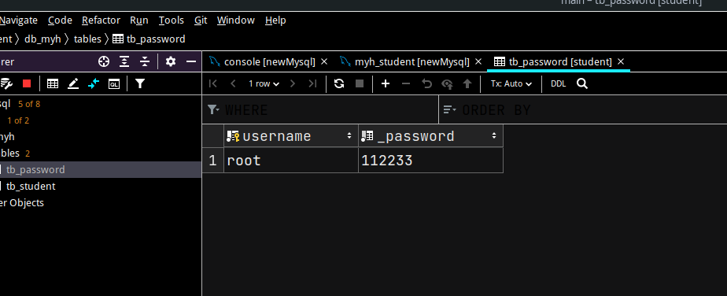
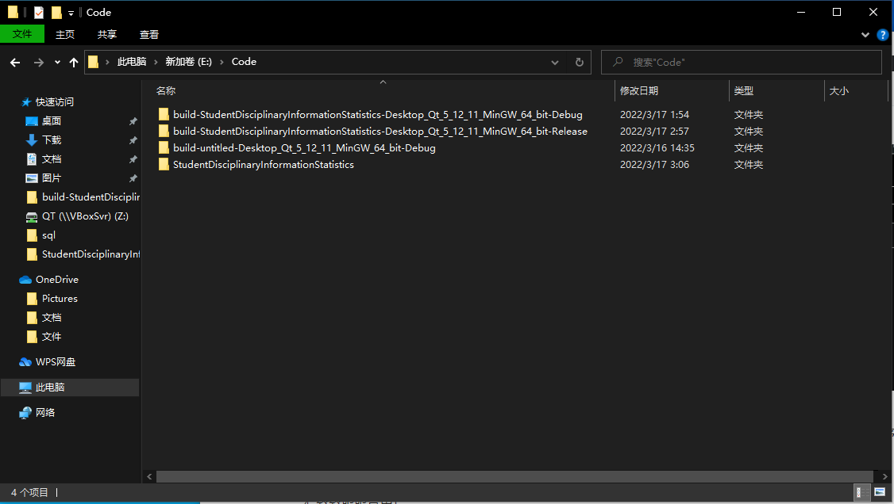
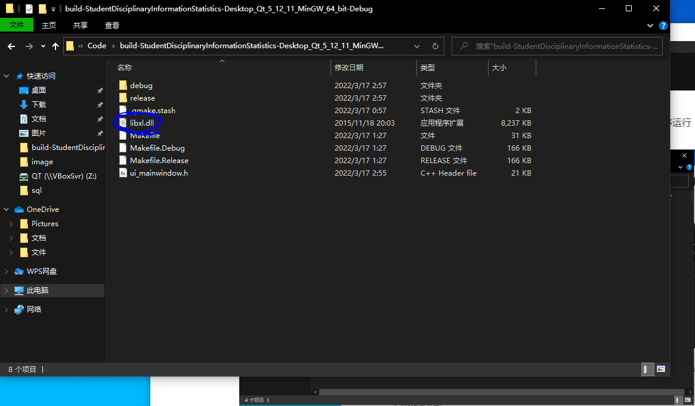

# 基于QT+Mysql学生违纪管理软件

## 大致功能

- 基本数据的增删改查

- 支持一键导出到Excel表格到桌面（自动识别桌面路径）
- 密码登录（有时间可以加一个MD5加密）
- json配置文件（时间关系，还没加）
- 用了一晚上做的没加什么太花哨的东西

## 主要技术

- QT5.12.12 + MinGW73_64
- Boost 1.78.0
- MySQL 5.7
- libxl 3.6.5.0 试用版

## 安装前的环境部署

- 由于用到了QSqlDatabase中的Mysql驱动，所以需要手动编译一下mysql驱动，[具体教程](https://www.bilibili.com/video/BV1Jk4y167tt)
- Boost库太大了 没办法推到Git库中 所以请自行下载 [下载链接](https://www.boost.org/users/download/)
- MySQL的查询表已经放在sql文件夹里面 通过navicat或者DataGrip直接运行就可以了
- 为了尽可能的简化代码 所有功能都写在了mainwindow.cpp和mainwindow.h两个文件里面

## 安装

1. 编辑mainwindow.cpp文件下sqlInit()函数

   ```c++
   bool MainWindow::sqlInit()
   {
       db = QSqlDatabase::addDatabase("QMYSQL");
       db.setConnectOptions("MYSQL_OPT_RECONNECT=1");
       db.setHostName("localhost");//数据库ip 本机用localhost或者127.0.0.1 远程用远程ip
       db.setUserName("root");//数据库用户名一般是root
       db.setPassword("");//数据库连接密码
       db.setDatabaseName("db_student");//数据库名称 根据main.sql文件中的数据库名为准
       db.setPort(3306);
       return db.open();
   }
   ```

2. 在数据库密码表中添加一个账号密码

   

3. 在QT Creator中编译

   编译的时候会有程序异常的报错，是因为libxl的动态链接库没有加载 将lib文件夹下的libxl.dll复制到程序运行路径就可以了

   

   

4. 舒舒服服享用！

## 联系

非常感谢我的两个好朋友德灵风雨、沙拉肉段（两位比较害羞没留真名）帮我找的图片。

大三学生闲来无事做的小玩意儿 感兴趣可以联系我

Email ： liuhuan@dthree.cn

主页（马上找工作了，刚搭建没怎么维护）：https://dthree.cn